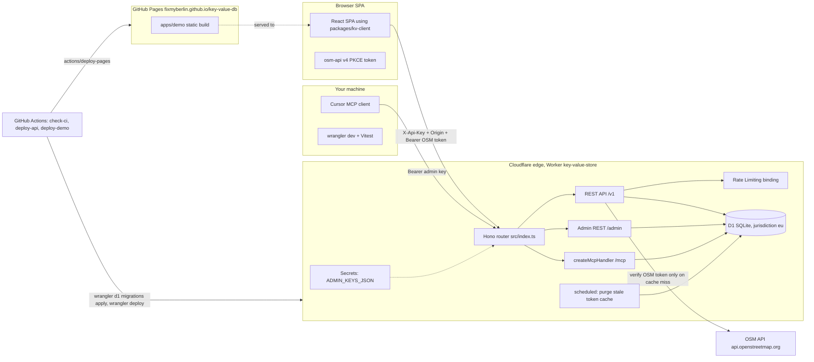
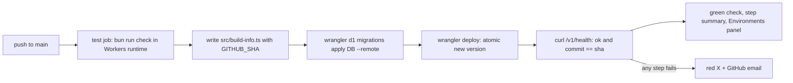

# Key-Value API for SPAs on Cloudflare Workers + D1, with a demo SPA on GitHub Pages (monorepo)

Sections 1 to 4 explain *what* is built and *how Cloudflare runs it* in plain language (you have not used Cloudflare before, so Section 2 and 4.5 are deliberately explanatory). Sections 5 onwards are the technical specification another model can implement from. Section 10 is the monorepo layout, Section 11 the demo SPA on GitHub Pages, Section 12 how code reaches Cloudflare and GitHub Pages, Section 13 the hostname question, Section 14 the free-tier budget.

The repo is `FixMyBerlin/key-value-db`, public, licensed AGPL-3.0 (same license and `LICENSE.md` text as tilda-geo; `"license": "AGPL-3.0"` in every `package.json`). It is a Bun-workspaces monorepo with three parts:

- `apps/api`: the Cloudflare Worker (this is the bulk of the plan, Sections 5 to 9).
- `packages/kv-client`: the typed fetch client SPAs use to talk to the API. Shared by the demo and, later, your real SPAs.
- `apps/demo`: a small React SPA deployed to GitHub Pages that logs in with OSM and exercises every API feature. It is the living integration test and the reference for wiring a real SPA. Scaffolded per the FMC `tech-stack` skill (Section 11).

Decision history: this plan replaces `php_kv_api_on_all-inkl_e659fdf8.plan.md`. The API design (projects, entries, tags, OSM token verification, MCP tool surface, TS client) is carried over unchanged; PHP, MySQL, FTPS and everything host-specific is gone. Facts below were checked against Cloudflare docs on 2026-09-08.

---

## 1. Goal in one paragraph

You own several React single-page apps (SPAs) without a backend. Their users log in with OpenStreetMap (OSM) OAuth 2.0 in the browser. You want a tiny shared backend, free at hobby scale, where each SPA ("project") can store and read arbitrary JSON records, each with an id and any number of tags. Writes must be attributable to a verified OSM user (stored as OSM user id). Admin work (create project, see key, set allowed origins) is done by you from Cursor via an MCP endpoint that runs inside the same Worker and is protected by an admin key. The whole thing is TypeScript on the Bun toolchain you already use.

## 2. What Cloudflare gives you and what the limits mean (Workers Free plan, Sept 2026)

Cloudflare Workers run your JavaScript in V8 isolates on Cloudflare's edge servers. There is no server, no process, no port: you upload a module with a `fetch(request, env, ctx)` export and Cloudflare invokes it per HTTP request, at the location closest to the caller. D1 is Cloudflare's serverless SQLite database, reached from the Worker through a *binding* (`env.DB`), not over a network connection string.

- Workers Free: 100,000 requests per day (resets midnight UTC; beyond that Cloudflare answers error 1027), 10 ms CPU time per invocation (I/O waits do not count; sha256 + JSON + a few D1 calls fit comfortably), 128 MB memory, 50 subrequests per request (outbound `fetch` and D1 queries), 3 MB bundle, 5 cron triggers per account, 100 Workers.
- D1 Free: 5 GB total storage (500 MB per database, 10 databases), 5 million rows *read* per day, 100,000 rows *written* per day, 50 queries per invocation. Since 2026-09-01 these daily limits are hard: queries fail until midnight UTC once exceeded, with an email alert. "Rows read" means rows *scanned*, so indexes are not optional; "rows written" counts every inserted/updated/deleted row, so the design keeps the hot read path write-free (Section 8).
- Workers Logs Free: 200,000 log events per day, 3 days retention, searchable in the dashboard, enabled with one line in `wrangler.jsonc`. Real logs, no FTP.
- Rate Limiting binding: GA, free, in-memory per Cloudflare location, windows of 10 or 60 s. Replaces a `rate_limits` table.
- Cron Triggers: a `scheduled()` export runs on a cron schedule. Replaces opportunistic cleanup.
- Secrets: `wrangler secret put NAME` stores encrypted values that arrive as `env.NAME`; they persist across deploys. Plain config lives as `vars` in `wrangler.jsonc`.
- Data location: D1 databases can be created with `--jurisdiction eu` (guaranteed to run and store data in the EU; set only at creation, cannot be changed later). The Worker code itself executes wherever the caller is; for German users that is typically Frankfurt or nearby, but this is not guaranteed on the free plan. Cloudflare is a US company; this is the price of the free tier compared to the all-inkl plan.
- Deploys are atomic: `wrangler deploy` uploads a new *version* and switches traffic in one step; `wrangler rollback` returns to the previous version. No mixed-version window like FTP sync.
- Paid fallback: Workers Paid is USD 5/month and lifts the request and D1 limits to monthly quotas that a hobby API will never reach.

Consequences for the design: single-file infrastructure config (`wrangler.jsonc`), SQLite dialect for the schema, no interactive transactions (D1 offers atomic `batch()` instead), row-write frugality, Bun for everything locally, GitHub Actions for deploys.

## 3. Architecture overview



## 4. The processes, explained for humans

### 4.1 Admin creates a project (via MCP from Cursor)

1. You add the KV MCP server to Cursor with the URL `https://KV_HOST/mcp` and header `Authorization: Bearer <your admin key>`.
2. You tell the agent: "Create project `parking-notes` with origins `https://parking.example.org` and `http://localhost:5173`".
3. The MCP tool `create_project` inserts a row, generates a project key like `kv_a3f9...` and returns slug, key and origins.
4. You paste the key and the API base URL into the SPA's `.env`. The key is public by design (it ships in the bundle); the origin allowlist is what stops other websites from using it in browsers.

Where the admin key lives (one value, three places, never in git):

- **Cloudflare, as a Worker secret.** You generate it once (`openssl rand -hex 32`) and store it with `bunx wrangler secret put ADMIN_KEYS_JSON` from your terminal. Cloudflare encrypts it and hands it to the Worker as `env.ADMIN_KEYS_JSON`. Secrets survive every deploy; `wrangler deploy` does not touch them. Rotating means running `secret put` again; no code change, no redeploy.
- **Your machine, as the client credential.** The same value goes into `~/.cursor/mcp.json` (`Authorization: Bearer ...` header, user-level file) and into the repo's gitignored `.dev.vars` so `wrangler dev` has it locally.
- **GitHub Actions: not at all.** The deploy workflow only holds `CLOUDFLARE_API_TOKEN` and `CLOUDFLARE_ACCOUNT_ID`, which let wrangler upload code and run migrations. It never sees the admin key.

One admin is the intended setup. The value is a tiny JSON map (`{"tordans":"<64 hex>"}`) rather than a bare string only so a second key (for example for a smoke test in CI) can be added or one key rotated later without invalidating the other. Section 8 has the comparison and rotation details.

### 4.2 How the SPA proves who the user is (no session handling in the SPA)

The SPA does **not** log in to our API and does not manage any session. It only forwards the OSM access token it already has:

1. The user logs into OSM inside the SPA as today (`osm-api` or `osm-auth`), producing an OSM OAuth 2.0 access token in the browser.
2. On every request that needs a user (all writes; reads only if the project demands it) the SPA sends that token as `Authorization: Bearer <osm access token>`. That is the whole client-side contract.
3. Inside the Worker, `osmAuth` hashes the token (`crypto.subtle.digest('SHA-256')`) and looks it up in the `verified_tokens` table.
   - Cache hit and not older than 1 hour: we already know the OSM uid and display name. No network call, no write.
   - Cache miss or stale: the Worker calls OSM's `GET /api/0.6/user/details.json` with the token. If OSM answers 200, the token is genuine; we store `hash -> uid, display_name, verified_at` and continue. If OSM answers 401, the request fails with `401 unauthenticated` and the SPA should prompt the user to log in to OSM again.
4. The plain token is never stored, only its hash. "Session" is therefore purely an internal cache inside the Worker's database; the SPA never sees a second token and never renews anything.

Cost of this simplicity: the OSM token travels with every authenticated request (always over HTTPS) instead of once per hour. For your own SPAs talking to your own API this is acceptable; see Section 8 for the trust note.

### 4.3 SPA writes a record

1. `PUT /v1/projects/{slug}/entries/{id}` with headers `X-Api-Key`, `Authorization: Bearer <osm access token>` and a JSON body `{ "data": {...}, "tags": ["a","b"] }`.
2. The API checks: key matches project, `Origin` header is in the project's origin list, OSM token verified (cache or live check, Section 4.2), and in Phase 2 that the uid is on the project's allowlist.
3. One atomic D1 `batch()`: upsert the entry row (bump `version`, set `updated_by`), delete its tag rows, re-insert tag rows.
4. Returns the stored entry including who/when.

### 4.4 SPA reads records

- One entry: `GET /v1/projects/{slug}/entries/{id}`.
- All entries: `GET /v1/projects/{slug}/entries` (paginated by cursor).
- By tags: `...?tag=a&tag=b&match=all` (or `match=any`), optionally `&updated_since=<ISO date>`.
- Reads only need key + allowed origin by default. A project can be switched to `read_access = osm_user` so reads also require a valid OSM token.

### 4.5 What happens on Cloudflare when a request arrives (the mental model to learn)

1. DNS for `KV_HOST` points at Cloudflare. TLS is terminated by Cloudflare; you never manage certificates.
2. The request reaches the Cloudflare data center nearest the caller. If no isolate for your Worker is warm there, one is started (cold start ~ms, not seconds).
3. Cloudflare calls your module's `fetch(request, env, ctx)`. `env` holds the *bindings* declared in `wrangler.jsonc`: `env.DB` (D1), `env.OSM_VERIFY_RL` (rate limiter), `env.ADMIN_KEYS_JSON` (secret), `env.OSM_API_BASE` (var). Bindings are how a Worker reaches other Cloudflare products; there are no connection strings or credentials in code.
4. Hono routes the request. Handlers `await env.DB.prepare(sql).bind(...).all()`; D1 executes the SQL on the database's primary location (EU) and returns rows.
5. Work that should not delay the response (writing the token cache, logging) is handed to `ctx.waitUntil(promise)`, which keeps the isolate alive after the response is sent.
6. `console.log` lines and the invocation itself become Workers Logs events you can search in the dashboard for 3 days.
7. Separately, the cron trigger invokes `scheduled(event, env, ctx)` once a day for cleanup.

Locally, `wrangler dev` (Miniflare) emulates exactly this, including a local SQLite file standing in for D1 under `.wrangler/state/`, so the code has no "local vs production" branches.

## 5. Concepts and vocabulary

- **Project**: one SPA / one dataset. Identified by a `slug` (`[a-z0-9-]{3,64}`). Has a `name`, an `api_key`, an `origins` list, and access settings.
- **Project key (`api_key`)**: `kv_` + 40 hex chars. Public identifier-plus-weak-secret, stored in plain text so the admin can read it back. It is *not* authentication; it only ties requests to a project and, together with `Origin`, deters casual abuse (same model as public map-tile keys).
- **Origin**: exact `scheme://host[:port]` strings. Comparison is exact except that a trailing `:*` allows any port (for `http://localhost:*`).
- **Entry**: one record in a project. Client-chosen `id` (1 to 128 chars of `[A-Za-z0-9._:/-]`, e.g. `way/123456` or a ULID), a JSON `data` payload (max 64 KiB serialized), and `tags` (0 to 32 strings, each 1 to 64 chars, trimmed, unique, case preserved).
- **Verified token (internal "session")**: a row in `verified_tokens` saying "the OSM token with this sha256 hash belonged to OSM uid X when we checked at time T". Valid for `OSM_VERIFY_TTL_S` (var, default 3600); after that the next request re-verifies against OSM. Not project-bound. The SPA never sees this table or any derived token.
- **Admin key**: long random string(s) in the secret `ADMIN_KEYS_JSON`, never in the DB or repo. Authorizes `/admin/*` and `/mcp`.
- **Cloudflare words**: *Worker* (your deployed module), *binding* (a named handle in `env` to D1, rate limiter, secret, var), *D1* (SQLite database), *wrangler* (Cloudflare's CLI: dev, deploy, migrations, secrets), *version* (each deploy; rollback target), *cron trigger* (scheduled invocation), *account subdomain* (`<account>.workers.dev`, free hostname for every Worker).

## 6. Data model (D1 = SQLite)

Database decision: **D1**. Workers KV was rejected because its free tier allows only 1,000 writes per day and has no query capability. D1 is SQLite, so the MySQL schema from the previous plan is translated: `INTEGER PRIMARY KEY AUTOINCREMENT` instead of `AUTO_INCREMENT`, `TEXT` with `CHECK(json_valid(...))` instead of `JSON`, `TEXT` ISO 8601 with milliseconds instead of `DATETIME(3)` (generated by `strftime('%Y-%m-%dT%H:%M:%fZ','now')`), `TEXT CHECK (col IN (...))` instead of `ENUM`. D1 enforces foreign keys by default. There are no interactive transactions; `env.DB.batch([...])` executes statements atomically and counts as one query toward the 50-per-invocation limit.

```sql
CREATE TABLE projects (
  id            INTEGER PRIMARY KEY AUTOINCREMENT,
  slug          TEXT NOT NULL UNIQUE,
  name          TEXT NOT NULL,
  api_key       TEXT NOT NULL UNIQUE,                          -- 'kv_' + 40 hex
  origins       TEXT NOT NULL CHECK (json_valid(origins)),     -- ["https://a.example", "http://localhost:*"]
  read_access   TEXT NOT NULL DEFAULT 'public'       CHECK (read_access IN ('public','osm_user')),
  write_access  TEXT NOT NULL DEFAULT 'any_osm_user' CHECK (write_access IN ('any_osm_user','allowlist')),
  created_at    TEXT NOT NULL,
  updated_at    TEXT NOT NULL,
  disabled_at   TEXT
);

CREATE TABLE osm_users (
  osm_uid       INTEGER PRIMARY KEY,
  display_name  TEXT NOT NULL,
  first_seen_at TEXT NOT NULL,
  last_seen_at  TEXT NOT NULL
);

CREATE TABLE entries (
  pk                  INTEGER PRIMARY KEY AUTOINCREMENT,
  project_id          INTEGER NOT NULL REFERENCES projects(id) ON DELETE CASCADE,
  entry_id            TEXT NOT NULL,
  data                TEXT NOT NULL CHECK (json_valid(data)),
  tags                TEXT NOT NULL CHECK (json_valid(tags)),  -- denormalized copy for fast reads
  version             INTEGER NOT NULL DEFAULT 1,
  created_at          TEXT NOT NULL,
  updated_at          TEXT NOT NULL,
  created_by_osm_uid  INTEGER NOT NULL,
  updated_by_osm_uid  INTEGER NOT NULL,
  UNIQUE (project_id, entry_id)
);
CREATE INDEX ix_entries_project_updated ON entries (project_id, updated_at, pk);

CREATE TABLE entry_tags (                                       -- normalized tag index
  entry_pk    INTEGER NOT NULL REFERENCES entries(pk) ON DELETE CASCADE,
  project_id  INTEGER NOT NULL,                                 -- denormalized for index locality
  tag         TEXT NOT NULL,
  PRIMARY KEY (entry_pk, tag)
);
CREATE INDEX ix_entry_tags_project_tag ON entry_tags (project_id, tag, entry_pk);

CREATE TABLE verified_tokens (                                  -- internal cache of OSM token checks
  token_hash   TEXT PRIMARY KEY,                                -- sha256 hex of the OSM access token
  osm_uid      INTEGER NOT NULL,
  verified_at  TEXT NOT NULL                                    -- last successful user/details.json call
);
CREATE INDEX ix_verified_tokens_verified_at ON verified_tokens (verified_at);

-- Phase 2
CREATE TABLE project_allowed_users (
  project_id INTEGER NOT NULL REFERENCES projects(id) ON DELETE CASCADE,
  osm_uid    INTEGER NOT NULL,
  note       TEXT,
  added_at   TEXT NOT NULL,
  PRIMARY KEY (project_id, osm_uid)
);
CREATE TABLE entry_history (
  id          INTEGER PRIMARY KEY AUTOINCREMENT,
  entry_pk    INTEGER NOT NULL,
  project_id  INTEGER NOT NULL,
  entry_id    TEXT NOT NULL,
  action      TEXT NOT NULL CHECK (action IN ('create','update','delete')),
  version     INTEGER NOT NULL,
  data        TEXT,
  tags        TEXT,
  osm_uid     INTEGER NOT NULL,
  at          TEXT NOT NULL
);
CREATE INDEX ix_hist_entry ON entry_history (project_id, entry_id, id);
```

Dropped versus the previous plan: `rate_limits` (replaced by the Rate Limiting binding), `schema_migrations` (wrangler keeps its own `d1_migrations` table), `verified_tokens.last_used_at` (a row write per authenticated request would eat the daily write budget for nothing).

Write path as one atomic batch (parameters: `?1` project_id, `?2` entry_id, `?3` data JSON, `?4` tags JSON, `?5` now, `?6` osm_uid, `?7` expected version or NULL):

```sql
INSERT INTO entries (project_id, entry_id, data, tags, version, created_at, updated_at, created_by_osm_uid, updated_by_osm_uid)
VALUES (?1, ?2, ?3, ?4, 1, ?5, ?5, ?6, ?6)
ON CONFLICT (project_id, entry_id) DO UPDATE SET
  data = excluded.data, tags = excluded.tags, version = entries.version + 1,
  updated_at = excluded.updated_at, updated_by_osm_uid = excluded.updated_by_osm_uid
WHERE ?7 IS NULL OR entries.version = ?7
RETURNING *;

DELETE FROM entry_tags WHERE entry_pk = (SELECT pk FROM entries WHERE project_id = ?1 AND entry_id = ?2);

INSERT INTO entry_tags (entry_pk, project_id, tag)
SELECT e.pk, e.project_id, j.value FROM entries e, json_each(?4) j
WHERE e.project_id = ?1 AND e.entry_id = ?2;
```

If the first statement returns no row, the `If-Match` guard failed: respond `409 version_conflict`. `json_each` inserts all tags in one statement, so a write costs 3 queries regardless of tag count. Row writes per PUT: 1 entry + (old tags deleted) + (new tags inserted); with the 32-tag cap worst case ~65 rows, typical 3 to 10.

Tag query with AND semantics (SQLite supports row-value comparison for the cursor):

```sql
SELECT e.* FROM entries e
JOIN (
  SELECT entry_pk FROM entry_tags
  WHERE project_id = ?1 AND tag IN (?2, ?3)
  GROUP BY entry_pk HAVING COUNT(DISTINCT tag) = 2
) m ON m.entry_pk = e.pk
WHERE (e.updated_at, e.pk) > (?4, ?5)
ORDER BY e.updated_at, e.pk LIMIT ?6;
```

`match=any` drops the `HAVING` clause. Pagination cursor = base64url of `updated_at|pk`.

## 7. HTTP API specification (`/v1`)

Unchanged from the previous plan except for the implementation notes marked *Worker*.

Common rules:

- JSON in and out (`Content-Type: application/json; charset=utf-8`). Max request body 128 KiB (check `Content-Length`, then read with a capped stream before `JSON.parse`).
- Project resolved from `{slug}` in the path; header `X-Api-Key` must equal `projects.api_key` (constant-time compare via `crypto.subtle.timingSafeEqual`) and project must not be disabled. *Worker*: one D1 read per request; cache the project row in module-scope memory for 60 s keyed by slug (isolates are reused; a stale origin list for at most a minute is acceptable and saves row reads).
- `Origin` header must match `projects.origins` on **every** `/v1/projects/*` request, including reads. A missing `Origin` is rejected (`403 origin_not_allowed`). Soft control; document it as such.
- CORS: on match respond `Access-Control-Allow-Origin: <origin>`, `Vary: Origin`, `Access-Control-Allow-Methods: GET, PUT, DELETE, POST, OPTIONS`, `Access-Control-Allow-Headers: Authorization, Content-Type, X-Api-Key, If-Match`, `Access-Control-Expose-Headers: ETag`, `Access-Control-Max-Age: 86400`. `OPTIONS` returns `204`. On mismatch return `403` without CORS headers. Implemented as a Hono middleware on `/v1/projects/*`, not Hono's generic `cors()` helper (the allowlist is per project).
- Authentication (writes always; reads when `read_access = osm_user`): `Authorization: Bearer <OSM OAuth 2.0 access token>`. Algorithm in `src/auth/osmAuth.ts`:
  1. Missing or malformed header -> `401 unauthenticated`.
  2. `h = hex(sha256(token))`; `SELECT osm_uid, verified_at FROM verified_tokens WHERE token_hash = ?`.
  3. Hit with `verified_at > now - OSM_VERIFY_TTL_S` -> accept, join `osm_users` for the display name (or cache both in one row). No network, no write.
  4. Otherwise: `env.OSM_VERIFY_RL.limit({ key: clientIp })` (binding configured as 10 per 60 s per IP; `429 rate_limited` with `Retry-After: 60` if exceeded), then `fetch(OSM_API_BASE + '/api/0.6/user/details.json', { headers: { Authorization } , signal: AbortSignal.timeout(8000) })`.
     - 200: parse `user.id` and `user.display_name`; in `ctx.waitUntil`, batch-upsert `osm_users` and `verified_tokens`; accept.
     - 401/403: delete any stale cache row; respond `401 unauthenticated`.
     - network error / 5xx / 429 from OSM: if a stale cache row exists and is younger than 24 h, accept it (grace) and log; else `502 osm_unavailable`.
  5. Resulting identity `{ osm_uid, display_name }` is set on the Hono context for `created_by` / `updated_by` and the Phase 2 allowlist check.
- Errors: `{ "error": { "code": "...", "message": "...", "details": {...}? } }`. Codes: `invalid_project_key` (401), `origin_not_allowed` (403), `unauthenticated` (401), `forbidden_user` (403), `not_found` (404), `validation_failed` (422), `payload_too_large` (413), `version_conflict` (409), `rate_limited` (429, with `Retry-After`), `osm_unavailable` (502), `internal` (500). Validation via Zod 4 schemas; `details.field` from the Zod issue path.

Entry representation:

```json
{
  "id": "way/123456",
  "data": { "any": "json" },
  "tags": ["sidewalk", "todo"],
  "version": 3,
  "created_at": "2026-09-08T08:00:00.000Z",
  "updated_at": "2026-09-08T09:12:44.120Z",
  "created_by": { "osm_uid": 12345, "display_name": "tordans" },
  "updated_by": { "osm_uid": 12345, "display_name": "tordans" }
}
```

Endpoints:

- `GET /v1/health` -> `{ "ok": true, "time": "...", "schema": "0001", "commit": "<git sha baked in at deploy>" }`. Runs `SELECT 1` so a broken D1 shows as `503 { ok: false }`. No auth, no CORS restriction. Used by the deploy workflow to confirm the pushed commit is live.
- `GET /v1/projects/{slug}/me` -> `{ "user": { "osm_uid": 12345, "display_name": "..." }, "can_write": true|false }` or `401`. Calling it once after OSM login warms the cache.
- `DELETE /v1/projects/{slug}/me` -> `204`. Evicts the cache row for this token (call on SPA logout; harmless to skip).
- `GET /v1/projects/{slug}/entries` query: `tag` (repeatable), `match=all|any` (default `all`), `updated_since` (ISO 8601), `limit` (1 to 500, default 100), `cursor`. Response `{ "items": [...], "next_cursor": "..."|null }`.
- `GET /v1/projects/{slug}/entries/{id}` -> entry, with `ETag: "<version>"`.
- `PUT /v1/projects/{slug}/entries/{id}` body `{ "data": <json>, "tags": [..] }`. Upsert via the batch in Section 6. Optional `If-Match: "<version>"` -> `409 version_conflict` if stale. `201` on create, `200` on update. Requires a verified OSM token and (Phase 2) allowlist membership.
- `DELETE /v1/projects/{slug}/entries/{id}` -> `204`; `404` if absent. Requires a verified OSM token. Hard delete in Phase 1 (cascade removes tags); Phase 2 writes an `entry_history` row first.
- `GET /v1/projects/{slug}/tags` -> `{ "tags": [ { "tag": "sidewalk", "count": 12 }, ... ] }` from `entry_tags`.

Validation (`422` with `details.field`): id regex and length; `data` must be a JSON object or array (no bare scalars) and <= 65536 bytes when re-encoded; tags array rules from Section 5; unknown top-level body fields rejected (Zod `.strict()`).

## 8. Security model in detail

- **Two layers, different purposes.** Layer 1 (project key + Origin) answers "which project, and is this a browser on an allowed site?". Layer 2 (verified OSM token) answers "which human is writing?". Only layer 2 is real authentication. Scripts can forge `Origin`; that is accepted and identical to how public map API keys work.
- **OSM token handling.** The Worker never stores the plain token, only `sha256(token)` plus the uid it mapped to. The token is never logged: the request logger only emits method, path, status, duration, project slug, and the OSM uid *after* verification. Trust note for SPA authors: OSM tokens typically also carry `write_api`; sending them to a third party is a trust decision. You operate both SPA and API, so this is acceptable; document it in the README. OSM access tokens currently do not expire; if OSM introduces expiry, verification starts failing with 401 and the SPA re-logs in.
- **Cache lifetime and write budget.** `OSM_VERIFY_TTL_S` var, default 3600. A cache hit costs one row read and zero writes; only cache misses write (2 rows, in `ctx.waitUntil`). Rows older than 24 h are purged by the daily cron (`DELETE FROM verified_tokens WHERE verified_at < ?`). Revocation: an OSM token revoked at OSM is refused at the latest after the TTL; the admin tool `revoke_tokens` (Phase 2) evicts rows for a uid immediately.
- **Admin keys.** Secret `ADMIN_KEYS_JSON` = `{"tordans-macbook":"<64 hex>", ...}`. Compare with `timingSafeEqual`. Rotate with `wrangler secret put ADMIN_KEYS_JSON` (takes effect within seconds, no code deploy). Locally the same value lives in `.dev.vars` (gitignored).
- **Authorization header.** Arrives untouched in the Worker; no proxy strips it. Nothing to configure.
- **Transport.** HTTPS is enforced by Cloudflare for `workers.dev` hostnames. Response headers on all API routes: `Strict-Transport-Security`, `X-Content-Type-Options: nosniff`, `Cache-Control: no-store`.
- **Rate limiting.** Phase 1: `OSM_VERIFY_RL` binding on verification cache misses (10 per 60 s per IP; per Cloudflare location, which is fine for abuse prevention). Phase 2: `WRITE_RL` per project+IP (e.g. 60 per 60 s) and `READ_RL` (e.g. 300 per 60 s). Client IP from the `cf-connecting-ip` header.
- **Input hardening.** D1 prepared statements with `bind()` only; `JSON.parse` after the size cap; Zod for shape; generic `internal` message to clients, full error in Workers Logs via `console.error` in Hono's `app.onError`.
- **Secrets never in the repo.** `wrangler.jsonc` holds bindings and non-secret vars only. `.dev.vars` and `.wrangler/` are gitignored. `worker-configuration.d.ts` (generated by `wrangler types`) is committed for type safety.
- **MCP endpoint hardening.** Admin bearer check runs *before* `createMcpHandler`; the handler additionally rejects requests carrying an unexpected browser `Origin` (built-in DNS-rebinding protection; Cursor sends no `Origin`). If a custom domain is added later, set `allowedHostnames: ['KV_HOST']` on the handler.
- **Phase 2 allowlist.** `write_access = allowlist` + `project_allowed_users`, managed via MCP tools `allow_user` / `disallow_user` / `list_allowed_users` taking OSM uid (numeric).

## 9. Admin MCP server (inside the same Worker)

MCP itself changed in July 2026: the 2026-07-28 spec is stateless (no `initialize` handshake, no sessions), and Cloudflare's Agents SDK v0.20+ serves it with `createMcpHandler` from a plain Worker, no Durable Object. `McpAgent` is deprecated. The handler also accepts older stateless clients, so Cursor works whether or not it has updated.

Dependencies: `agents`, `@modelcontextprotocol/server@2`, `zod`. Compatibility flag `nodejs_compat` in `wrangler.jsonc`.

Wiring (`src/mcp/server.ts`):

- `createServer(ctx)` factory builds a fresh `McpServer({ name: 'kv-admin', version })` per request and calls `server.registerTool(name, { description, inputSchema: { ...zod shape } }, handler)` for each tool. The handler receives `env` through a closure created per request (the factory is called with a request context; we build the handler inside Hono's route so `c.env` is in scope).
- Route: `app.all('/mcp', adminAuth, (c) => createMcpHandler(() => createServer(c.env))(c.req.raw, c.env, c.executionCtx))`. Return the handler's `Response` unchanged.
- `adminAuth` middleware: `Authorization: Bearer <key>` checked against `ADMIN_KEYS_JSON`; `401` JSON otherwise. It is shared with `/admin/*`.
- Tool results: `{ content: [{ type: 'text', text: JSON.stringify(result, null, 2) }], structuredContent: result }`; errors as `{ isError: true, content: [{ type: 'text', text }] }`.

Tools (Zod input schemas):

- `list_projects()` -> slugs, names, origins, access settings, entry counts, `disabled_at`.
- `create_project({ slug, name, origins: string[], read_access?, write_access? })` -> project incl. `api_key`. Validates slug regex and origin format (`^https?://[a-z0-9.-]+(:(\d+|\*))?$`).
- `get_project({ slug })` -> full record incl. `api_key` and stats (entries, tags, distinct writers).
- `update_project({ slug, name?, origins?, read_access?, write_access?, disabled? })`.
- `rotate_project_key({ slug })` -> new `api_key`.
- `delete_project({ slug, confirm_slug })` -> cascades entries; requires `confirm_slug === slug`.
- `db_status()` -> applied migrations (`SELECT * FROM d1_migrations`), row counts per table. (Migrations themselves are applied by wrangler at deploy time, Section 12, not via MCP.)
- Phase 2: `allow_user({ slug, osm_uid, note? })`, `disallow_user`, `list_allowed_users`, `entry_stats({ slug })`, `revoke_tokens({ osm_uid })`.

Cursor configuration (`~/.cursor/mcp.json`, user-level, never committed):

```json
{
  "mcpServers": {
    "kv-admin": {
      "url": "https://KV_HOST/mcp",
      "headers": { "Authorization": "Bearer <admin key>" }
    }
  }
}
```

The same tools are exposed as plain REST under `/admin/*` with the same bearer key (thin wrappers around the shared `src/admin/tools.ts` functions) so `curl` and tests can use them without an MCP client.

## 10. Monorepo layout, tooling, local development

Bun workspaces: one `bun install` at the root, one lockfile, shared dev tooling, per-app scripts. Does this work with a Worker and a Vite SPA side by side? Yes: wrangler and Vite each read their own config inside their app folder; the only shared things are `node_modules`, TypeScript, oxlint/oxfmt and the CI orchestrators. The `kv-client` package is consumed as `"@kv/client": "workspace:*"`, so the demo always compiles against the client that ships with the API commit it is deployed with.

```
key-value-db/
  package.json                 # "workspaces": ["apps/*", "packages/*"]; root orchestrators (below)
  bunfig.toml  .nvmrc          # tech-stack bun-install.md (global store, Bun >= 1.3.14; Node only for Playwright later)
  oxlint.config.mjs  oxfmt.config.mjs   # tech-stack templates, shared by all workspaces
  knip.config.mjs              # workspaces section per app/package
  tsconfig.json                # references to apps/api, apps/demo, packages/kv-client (no compilerOptions of its own)
  .vscode/settings.json  .vscode/extensions.json   # TS 7 language server pointed at root node_modules/typescript
  .cursor/rules/package-json-scripts.md            # tech-stack template
  .github/
    dependabot.yml             # bun ecosystem + github-actions, one open PR each; schedule: private OSS -> first Friday monthly
    workflows/ci.yml           # pull_request: dependency-review + bun run check-ci (root, fans out)
    workflows/deploy-api.yml   # Section 12.2
    workflows/deploy-demo.yml  # Section 12.4
  apps/
    api/                       # the Cloudflare Worker
      wrangler.jsonc           # name key-value-store, main src/index.ts, compatibility_date, nodejs_compat, d1_databases[DB], ratelimits, triggers.crons, observability, vars
      worker-configuration.d.ts  # generated by `wrangler types`, committed
      tsconfig.json            # tech-stack tsconfig.scripts.json profile (no DOM) + types from worker-configuration.d.ts
      src/
        index.ts               # export default { fetch: app.fetch, scheduled }
        app.ts                 # Hono app: middleware order, routes, onError -> JSON envelope
        env.ts                 # config helpers (ttl, osm base)
        build-info.ts          # export const BUILD_SHA = 'dev'; overwritten in CI before deploy
        http/   cors.ts errors.ts json.ts cursor.ts
        auth/   projectAuth.ts osmAuth.ts osmClient.ts adminAuth.ts
        store/  projects.ts entries.ts tags.ts verifiedTokens.ts users.ts
        api/    health.ts me.ts entries.ts tags.ts
        admin/  tools.ts routes.ts      # shared tool functions + REST wrappers
        mcp/    server.ts               # createMcpHandler factory, registerTool for each tool
        cron/   cleanup.ts              # scheduled(): purge verified_tokens
        schemas/ project.ts entry.ts    # Zod 4
      migrations/              # 0001_init.sql, 0002_... (flat *.sql layout)
      test/
        apply-migrations.ts    # setupFile: applyD1Migrations(env.DB, env.TEST_MIGRATIONS)
        api.test.ts entries.test.ts osmAuth.test.ts mcp.test.ts
      vitest.config.mts        # cloudflareTest({ wrangler: { configPath }, miniflare: { bindings: { TEST_MIGRATIONS, ADMIN_KEYS_JSON } } })
      .dev.vars                # gitignored: ADMIN_KEYS_JSON for wrangler dev
      .dev.vars.example        # committed
      package.json
    demo/                      # the GitHub Pages SPA, Section 11
      index.html  vite.config.ts  tsconfig.json (tech-stack tsconfig.app.json profile)
      public/osm-oauth-land.html          # OAuth redirect landing page, copied from street-space-editor
      .env.development  .env.production   # public VITE_* values, committed (Section 11.3)
      src/
        lib/osmAuth.ts         # osm-api v4: login/redirect, authReady, getAuthToken, logout; redirect URL helper
        lib/kv.ts              # createKvClient({ ..., getOsmToken: () => getAuthToken() ?? null })
        routes/ ...            # TanStack Router file routes (Section 11.2)
      package.json
  packages/
    kv-client/                 # "@kv/client"
      src/index.ts  src/types.ts  src/errors.ts
      test/kvClient.test.ts    # Vitest (node env), fetch mocked
      package.json             # "exports": { ".": "./src/index.ts" } (consumed as source; no build step)
      tsconfig.json            # scripts profile with lib DOM added for fetch types
  README.md  PLAN.md (this document)
```

Root `package.json` scripts follow the tech-stack `package-json-scripts.md` policy; the root orchestrators fan out to workspaces with `bun run --filter '*' <leaf>`:

- Leaves per workspace: `type-check`, `lint`, `lint-check`, `format`, `format-check`, `test-run`.
- Root: `check` = `bun run --parallel type-check lint format test-run knip-warn` (each root leaf is `bun run --filter '*' <leaf>`), `check-ci` = `--parallel type-check lint-check format-check test-run`, `knip`, `knip-warn`, `check-pre-push`.
- `apps/api` extras: `dev` (`wrangler dev`), `db-migrate-local` (`wrangler d1 migrations apply DB --local`), `db-migrate-remote`, `types` (`wrangler types`), `deploy` (`wrangler deploy`, for emergencies; normal path is CI).
- `apps/demo` extras: `dev` (`FORCE_COLOR=1 bun --bun vite dev`), `build` (`bun --bun vite build`), `preview`.

Shared tooling decisions (from the tech-stack skill; applies to all three workspaces): Bun >= 1.3.14 with `globalStore` and the committed `bunfig.toml`; `typescript@^7` once at the root, `tsc --noEmit -p <workspace>` per workspace; oxlint + oxfmt with the skill's config templates (printWidth 100, `semi: asNeeded`, single quotes, import/class sorting, `switch-exhaustiveness-check`); Vitest everywhere (the Workers pool only in `apps/api`); Zod 4 wherever input is validated; Knip with a `workspaces` config so each app's entry points are traced; Dependabot with the skill's template. `.nvmrc` exists only so Playwright (Phase 2) has a Node; nothing else uses Node.

What the tech-stack skill does *not* apply to `apps/api`: React, TanStack, Tailwind, maps, browserslist (there is no browser bundle; the Worker targets Cloudflare's V8 with `compatibility_date`). Its tsconfig is the skill's `tsconfig.scripts.json` profile (bundler resolution, no DOM lib) plus `worker-configuration.d.ts`.

`apps/api` specifics:

- Runtime deps: `hono`, `zod`, `agents`, `@modelcontextprotocol/server`. Dev deps: `wrangler` (4.x), `@cloudflare/vitest-pool-workers`, `vitest`.
- Local loop: `bun install` (root), `bun run --filter api db-migrate-local`, `bun run --filter api dev` -> `http://localhost:8787`. Miniflare provides a local D1 and honors `ratelimits`, `triggers` (`wrangler dev --test-scheduled` exposes `/__scheduled` to fire the cron) and `.dev.vars`.
- Tests run *inside* the Workers runtime via `@cloudflare/vitest-pool-workers`: `readD1Migrations('./migrations')` in `vitest.config.mts` feeds `applyD1Migrations` in the setup file (flat `*.sql` layout only; do not adopt nested migration folders). Tests import `SELF` from `cloudflare:test` and call the API with `SELF.fetch(...)`. The OSM call is mocked with `fetchMock` from `cloudflare:test` (undici MockAgent: `fetchMock.get('https://api.openstreetmap.org').intercept({ path: '/api/0.6/user/details.json' }).reply(200, {...})`), so no test-only routes exist in production code. Coverage: project auth, origin matching incl. `localhost:*`, CORS preflight, token cache hit/miss/stale/grace, CRUD, `If-Match`, tag AND/OR + cursor + `updated_since`, tags endpoint, admin REST, one MCP `tools/list` + `tools/call` round trip, cron cleanup.

`packages/kv-client` specifics:

- `createKvClient({ baseUrl, project, apiKey, getOsmToken })` returning `list({ tags, match, updatedSince, limit, cursor })`, `get(id)`, `put(id, data, tags, { ifMatch })`, `remove(id)`, `tags()`, `me()`, `forget()`. Stateless: adds `X-Api-Key` always and `Authorization: Bearer ${await getOsmToken()}` when a token is available. Errors are thrown as `KvError { status, code, message, details }` mirroring the API envelope, so a SPA can `switch (err.code)` on `unauthenticated` (prompt OSM login) or `version_conflict` (reload and retry).
- Generic over the entry `data` type: `createKvClient<MyData>(...)`; the client does not validate payloads (that is the API's job and the SPA's Zod schema's job), so it has zero runtime dependencies.
- `getOsmToken` is a one-liner per SPA. With `osm-api` v4 (what street-space-editor and the demo use): `() => getAuthToken() ?? null`. With `osm-auth`: `() => auth.authenticated() ? auth.token() : null`.
- Tested with Vitest in the default node environment and a mocked `fetch`. The `apps/api` integration tests call the Worker directly via `SELF.fetch`, so the demo is the place where client and API meet for real.

## 11. Demo SPA on GitHub Pages (`apps/demo`)

Purpose: a deployed, clickable proof that the whole chain works (GitHub Pages origin -> CORS -> project key -> OSM PKCE login -> token forwarding -> verified writes -> tag queries -> conflict handling), and the copy-paste reference for integrating your real SPAs. It is deliberately small and has no map: the API is not geo-specific, and leaving `react-map-gl` out keeps the demo's dependency surface and CI time small. Add a map later if a real SPA needs a worked example.

### 11.1 Stack (per the tech-stack skill)

- Vite 8 (`bun --bun vite`), React 19 with the React Compiler on (`viteReact({ compiler: true })` + `oxc-transform-react`), `typescript@^7` with the skill's `tsconfig.app.json` profile, oxlint `react` plugin with `react/unsupported-syntax: error`.
- TanStack Router (file-based routes, `validateSearch` with Zod 4 for the tag filter in the URL) and TanStack Query for all API calls (no `useEffect` fetching; mutations invalidate the entries query). URL state via router search params per `tanstack-router-conventions`.
- Tailwind CSS with `@tailwindcss/forms`, `tailwind-merge`; a Fontsource font. Zustand only if a global client state appears (it should not; auth state comes from `osm-api`'s `isLoggedIn()` via a small Query, everything else from Query or the URL).
- `browserslist` in `package.json` drives Vite's client target and `eslint-plugin-compat` in oxlint (tech-stack `browser-target.md`).
- Vitest for pure logic (cursor/tag helpers, search-param schemas). Playwright is Phase 2 (Section 15).
- OSM login: **`osm-api` v4**, the same library street-space-editor uses (its `@osm-editor-kit/osm-oauth` wrapper is private and unpublished, so the demo calls `osm-api` directly and copies the two patterns that matter). `login({ mode: 'redirect', clientId, redirectUrl, scopes: ['read_prefs'] })` runs Authorization Code + PKCE; redirect mode, not popup, because openstreetmap.org sends `COOP: same-origin`, which nulls `window.opener` and breaks the popup completion. `await authReady` on startup finishes a pending redirect; `isLoggedIn()` / `getAuthToken()` / `logout()` are the whole API surface the demo needs. The OSM OAuth 2 application is registered with "Confidential application" **unchecked**, so there is no client secret and the public client id may be committed.
- Redirect landing page: `apps/demo/public/osm-oauth-land.html`, copied from street-space-editor. It receives `?code=&state=`, restores the pre-login deep link from `localStorage`, and `location.replace`s back into the app under the Vite base, where `authReady` completes the token exchange. Redirect URIs registered on the OSM app (exact match): `http://127.0.0.1:33477/key-value-db/osm-oauth-land.html` and `https://fixmyberlin.github.io/key-value-db/osm-oauth-land.html`. The redirect URL is derived from `import.meta.env.BASE_URL` + filename (as in the editor's `getOsmOAuthRedirectUrl`), never from `location.pathname`.
- Dev server: `server: { host: '127.0.0.1', port: 33477, strictPort: true }` in `vite.config.ts`, exactly like street-space-editor's fixed `127.0.0.1:33444`. OSM allows `http` redirect URIs only on `127.0.0.1`, and a fixed port means the registered URI never drifts. 33477 is not used by any other local project (5173: tilda-geo-* apps, 4000: trassenscout, 33444: street-space-editor and parking-lanes). The `demo` project's origin list therefore contains `http://127.0.0.1:33477`, not a `localhost` wildcard.

### 11.2 Screens and what each one proves

- `/`: status card. Shows `GET /v1/health` (API reachable, schema, commit), the configured project slug, and the OSM login button. After login, calls `GET /v1/projects/{slug}/me` and shows uid, display name, `can_write`. Proves CORS, project key, origin allowlist, token verification and cache warm-up.
- `/entries?tag=a&tag=b&match=all`: paginated list from `list()`, tag filter chips bound to the URL, "load more" using `next_cursor`, an `updated_since` toggle ("changed in the last hour"). Proves tag AND/OR queries and cursor pagination.
- `/entries/$id`: editor with a JSON textarea (validated by a small Zod schema for the demo's own `data` shape, e.g. `{ title: string, note?: string }`), tag input, Save (`put` with `If-Match` from the loaded version), Delete. On `version_conflict` it shows both versions and offers "reload". Proves writes, attribution (`created_by`/`updated_by`), optimistic concurrency.
- `/tags`: counts from `tags()`; click navigates to the filtered list.
- Logout button calls `forget()` (`DELETE /me`) and `osm-api`'s `logout()`.
- A footer shows the demo's own build sha (Vite `define`) next to the API's, so you can see which pair is live.

### 11.3 Configuration and hosting

- Public config in committed env files read by Vite: `VITE_KV_BASE_URL` (`https://KV_HOST`), `VITE_KV_PROJECT` (`demo`), `VITE_KV_API_KEY` (public by design), `VITE_OSM_OAUTH_CLIENT_ID` (public by design, PKCE client). `.env.development` points at `http://localhost:8787` for the API. Nothing secret exists on the SPA side, which is the whole point of the design. (street-space-editor keeps the client id in a gitignored root `.env` + `.env.example`; the demo commits it because the repo is public anyway and a public PKCE client id is not a secret.)
- The `demo` project is created once via MCP with origins `https://fixmyberlin.github.io` and `http://127.0.0.1:33477`. Note the GitHub Pages `Origin` header is the bare `https://fixmyberlin.github.io` (no path), so every project page under the org shares it; acceptable for a demo, and the reason real SPAs get their own hostnames.
- Vite `base: '/key-value-db/'` (project site under `fixmyberlin.github.io`). TanStack Router gets `basepath: '/key-value-db'`. A `404.html` that redirects to `index.html` with the path preserved gives deep links on Pages (standard SPA-on-Pages trick).
- GitHub Pages is enabled with source "GitHub Actions" (repo Settings -> Pages). The repo is public and open source (AGPL-3.0), so Pages is available on the org's plan without further conditions. The code contains no secrets (Section 8).

## 12. Getting code onto Cloudflare and GitHub Pages

Two targets, two workflows, both triggered by pushes to `main` and filtered by path so an API change does not rebuild the demo and vice versa (a `packages/kv-client` change triggers both). The API side first.

Two mechanisms exist for Cloudflare and you asked which to learn:

- **Workers Builds** (Netlify-style): you connect the GitHub repo in the Cloudflare dashboard; Cloudflare clones, runs a build command and a deploy command on every push, posts a status to the commit, and gives preview URLs for branches. No API token to manage. But: tests only gate the deploy if you put them in the build command, D1 migrations must be chained into the deploy command, failures are debugged in the Cloudflare dashboard, and there is no post-deploy assertion.
- **GitHub Actions + `cloudflare/wrangler-action`** (chosen): the workflow you already know from your other repos runs tests, applies D1 migrations, deploys, then asserts `/v1/health` reports the pushed sha. Everything is one readable YAML in the repo; failures are red checks and GitHub emails. The only extra chore is one Cloudflare API token stored as a GitHub secret.

Chosen: GitHub Actions. It matches how you deploy everything except Netlify, it keeps the "deploy OK means the new code is live and healthy" guarantee, and wrangler is the same tool you use locally, so nothing is dashboard-only. Workers Builds remains a 10-minute switch later if you prefer it.



### 12.1 GitHub as the home of the code

- Repo `FixMyBerlin/key-value-db`, public, AGPL-3.0: `LICENSE.md` is the verbatim AGPL-3.0 text as in tilda-geo, `"license": "AGPL-3.0"` in the root and every workspace `package.json`, and the README states the license. The tech-stack `ci.yml` template's `dependency-review` `allow-licenses` already includes `AGPL-3.0` and `AGPL-3.0-or-later`.
- `main` is the deploy branch for both targets. Each deploy job has `needs: test`, so red CI never deploys.
- The repo holds no secrets (Section 8), so public is safe; the demo doubles as a public reference for integrating the API.
- Creating the repo in the org and the first push are owner actions (they publish under the org); listed as a todo, waits for your explicit go-ahead.

### 12.2 API: push equals deploy, and how you learn the result (`deploy-api.yml`)

- **Commit status.** Each step after tests is an assertion: `wrangler d1 migrations apply` exits non-zero on SQL errors, `wrangler deploy` exits non-zero on upload/validation errors, `curl -fsS https://KV_HOST/v1/health | jq -e --arg sha "$GITHUB_SHA" '.ok and .commit == $sha'` fails unless the new code is serving.
- **Failure notification.** GitHub emails the pusher on failed workflow runs (default notification setting); success is silent.
- **Step summary.** The workflow appends to `$GITHUB_STEP_SUMMARY`: deployed sha, migrations applied (wrangler prints them), health response, `wrangler deploy` version id.
- **Environments panel.** `environment: { name: cloudflare, url: https://KV_HOST/v1/health }` records a Deployment visible in the repo sidebar.
- **Rollback.** `wrangler rollback` (locally, or a `workflow_dispatch` job) switches back to the previous version in seconds. Migrations are forward-only, so keep them additive (add columns/tables, never drop in the same release as the code that stops using them).
- **Manual runs.** `workflow_dispatch` with `dry_run=true` runs `wrangler deploy --dry-run --outdir dist` (bundles and validates without uploading) and skips migrations.

### 12.3 One-time owner steps (Cloudflare dashboard, terminal, GitHub, OSM)

1. Create a Cloudflare account (free). In Workers & Pages, register your account subdomain `<account>.workers.dev` (one click; determines `KV_HOST = key-value-store.<account>.workers.dev`).
2. Locally: `bunx wrangler login`, then `bunx wrangler d1 create key-value-store --jurisdiction eu`. Copy the printed `database_id` into `wrangler.jsonc` under `d1_databases[0]`. The jurisdiction cannot be changed later, so do this before any data exists.
3. `bunx wrangler secret put ADMIN_KEYS_JSON` and paste `{"tordans":"<64 hex from openssl rand -hex 32>"}`. Put the same JSON in `.dev.vars` for local dev.
4. Cloudflare dashboard -> My Profile -> API Tokens -> Create Token -> "Edit Cloudflare Workers" template, then add permission **D1: Edit** (without it, `d1 migrations apply` fails silently in CI, a known wrangler issue). Scope to your account. Note the token and your Account ID (Workers overview page).
5. GitHub repo Settings -> Environments -> `cloudflare` with secrets `CLOUDFLARE_API_TOKEN`, `CLOUDFLARE_ACCOUNT_ID`, and variable `KV_HOST`.
6. First API deploy: run `deploy-api` via `workflow_dispatch` with `dry_run=true`, inspect the log, then push to `main`.
7. Add the MCP server to Cursor (Section 9) and create the `demo` project with origins `https://fixmyberlin.github.io` and `http://127.0.0.1:33477`. Paste the returned key into `apps/demo/.env.production` and `.env.development`.
8. OSM: openstreetmap.org -> My Settings -> OAuth 2 applications -> Register new application: name `key-value-db demo`, redirect URIs `http://127.0.0.1:33477/key-value-db/osm-oauth-land.html` and `https://fixmyberlin.github.io/key-value-db/osm-oauth-land.html` (exact match), "Confidential application" unchecked, scope `read_prefs`. Paste the client id into the demo env files as `VITE_OSM_OAUTH_CLIENT_ID`.
9. GitHub repo Settings -> Pages -> Source: "GitHub Actions". Push; `deploy-demo` publishes to `https://fixmyberlin.github.io/key-value-db/`.

`deploy-api.yml` outline:

- Triggers: `push` to `main` with `paths: [apps/api/**, packages/kv-client/**, .github/workflows/deploy-api.yml]`; `workflow_dispatch` with boolean input `dry_run` (default `true`).
- Job `test`: `actions/checkout@v6`, `oven-sh/setup-bun@v2`, `bun install --frozen-lockfile`, `bun run check-ci` (root; fans out to all workspaces, cheap enough to run whole).
- Job `deploy` (`needs: test`, `permissions: contents: read, deployments: write`, `concurrency: { group: deploy-api, cancel-in-progress: false }`, `environment: { name: cloudflare, url: https://${{ vars.KV_HOST }}/v1/health }`, `defaults.run.working-directory: apps/api`):
  1. checkout, setup-bun, `bun install --frozen-lockfile` (root).
  2. `printf "export const BUILD_SHA = '%s'\n" "$GITHUB_SHA" > src/build-info.ts` (baked into the bundle; avoids `wrangler deploy --var`, whose merge semantics changed across wrangler 4.x releases).
  3. `cloudflare/wrangler-action@v4` with `apiToken`, `accountId`, `workingDirectory: apps/api`, `command: d1 migrations apply DB --remote` (skipped on dry run).
  4. `cloudflare/wrangler-action@v4` with `command: deploy` (or `deploy --dry-run --outdir dist` on dry run).
  5. `curl -fsS --retry 5 --retry-delay 2 https://$KV_HOST/v1/health | jq -e --arg sha "$GITHUB_SHA" '.ok and .commit == $sha'`.
  6. Append summary to `$GITHUB_STEP_SUMMARY`.
- `ci.yml` (tech-stack template): on `pull_request`, `dependency-review-action` plus the same `check-ci` job.

Notes:

- Migrations run *before* the deploy, so new code never meets an old schema; the old code meets the new schema for a few seconds, which is why migrations must be additive.
- `wrangler.jsonc` is the single source of truth for bindings, vars, cron, observability. Do not edit vars in the dashboard; a deploy overwrites them (secrets are untouched).
- Logs: dashboard -> Workers & Pages -> key-value-store -> Logs (3 days). `bunx wrangler tail` streams live logs to the terminal, useful during the first deploys.

### 12.4 Demo: push equals publish (`deploy-demo.yml`)

GitHub Pages via Actions is the static-hosting analogue of the Cloudflare flow: build once, upload the artifact, let the platform publish it atomically.

- Triggers: `push` to `main` with `paths: [apps/demo/**, packages/kv-client/**, .github/workflows/deploy-demo.yml]`; `workflow_dispatch`.
- `permissions: { contents: read, pages: write, id-token: write }`; `concurrency: { group: pages, cancel-in-progress: true }` (only the newest build matters for a static site).
- Job `build`: checkout, setup-bun, `bun install --frozen-lockfile`, `bun run check-ci`, `bun run --filter demo build` with `VITE_BUILD_SHA=$GITHUB_SHA`, `actions/configure-pages@v5`, `actions/upload-pages-artifact@v3` with `path: apps/demo/dist`.
- Job `deploy` (`needs: build`, `environment: { name: github-pages, url: ${{ steps.deployment.outputs.page_url }} }`): `actions/deploy-pages@v4`.
- Result: green check on the commit, Environments panel entry `github-pages` with the live URL, failure email as with the API. There is no health assertion because the artifact upload *is* the deployment; the demo's footer shows both build shas for eyeballing.
- Deep links: `apps/demo/public/404.html` copies `index.html` (Vite build step or a tiny script) so `/key-value-db/entries/way%2F1` resolves on Pages.
- The API and the demo deploy independently; the client package is the contract. A breaking API change lands as: API deploy with backward-compatible behaviour first, client + demo update second. Same rule as the additive migrations.

## 13. Hostname: `workers.dev` now, `key-value-store.tilda-geo.de` later

- Phase 1 uses `https://key-value-store.<account>.workers.dev`. Free, HTTPS, no DNS work. The hostname appears in exactly one place per SPA (`.env`), so changing it later is a one-line edit and a redeploy of the SPA.
- A Workers **custom domain** costs nothing in money but requires the DNS zone of that domain to be hosted on Cloudflare. `tilda-geo.de` currently uses United Domains nameservers (`ns.udag.de/net/org`), so `key-value-store.tilda-geo.de` would mean moving the whole `tilda-geo.de` zone to Cloudflare (free plan, keep all existing records, change nameservers at United Domains). That is an FMC production domain; treat it as a separate decision with the team, not as part of this project.
- Middle path without a nameserver move: Cloudflare for SaaS custom hostnames (free, 100 hostnames) let a Worker serve a hostname that stays at another DNS provider via a CNAME plus an `_acme-challenge` record, but it requires *some* zone on Cloudflare to attach to. If you ever have one, this is the way to get `key-value-store.tilda-geo.de` without touching the zone's nameservers.
- When a custom domain is added: `routes: [{ pattern: 'key-value-store.tilda-geo.de', custom_domain: true }]` in `wrangler.jsonc`, API token gets "Workers Routes: Edit", MCP handler gets `allowedHostnames`, `KV_HOST` variable changes. Nothing else.

## 14. Free-tier budget and what to watch

- Requests: 100k/day. A hobby SPA fleet with a few hundred daily users stays far below; the OPTIONS preflight counts as a request, so `Access-Control-Max-Age: 86400` matters.
- D1 row writes: 100k/day. Costs: PUT = 1 + old tags + new tags rows; DELETE = 1 + tags; token cache miss = 2; cron = purged rows. 5,000 PUTs with 5 tags each ~ 55k rows. If you ever see the "exceeded daily row write limit" email, batching SPA writes (Phase 2 `POST /entries:batch`) or Workers Paid (USD 5/month) are the levers.
- D1 row reads: 5M/day. Reads are rows *scanned*; every list query uses `ix_entries_project_updated` or `ix_entry_tags_project_tag`, and `COUNT(*)` in admin tools is acceptable only because admin calls are rare. Avoid `LIKE` searches on `data`.
- CPU 10 ms: no JSON payload above 64 KiB, no synchronous crypto beyond one sha256. Hono + Zod overhead is ~1 ms.
- Logs 200k events/day: log one structured line per request, not per step; `head_sampling_rate` can be lowered later.
- Watch these in the dashboard Analytics tab after the first week; set the D1 email alert (default on).

## 15. Phases

Phase 0, skeleton: monorepo scaffold per `tech-stack` skill (workspaces, bunfig, oxlint/oxfmt, TS 7, knip, dependabot, `.vscode`, `.cursor/rules`), `apps/api` with `wrangler.jsonc`, `worker-configuration.d.ts`, Hono app with `/v1/health`, `migrations/0001_init.sql`, Vitest pool setup with migrations; `packages/kv-client` stub; `apps/demo` Vite + Router shell with the status page; `ci.yml`, `deploy-api.yml` dry run, `deploy-demo.yml` first publish.

Phase 1, MVP: projects (admin REST + MCP `list/create/get/update/rotate/delete/db_status`), CORS + origin enforcement, OSM token verification with `verified_tokens` cache, `OSM_VERIFY_RL` binding, `/me`, entries CRUD with batch upsert and `If-Match`, list with tags/cursor/`updated_since`, `tags` endpoint, cron cleanup, full `kv-client`, API tests, first real API deploy, `demo` project created from Cursor, OSM OAuth app registered, demo screens (status/me, entries list with tag filter, editor with conflict handling, tags), README with SPA integration steps and Cloudflare how-to.

Phase 2, hardening and extras: `write_access = allowlist` + user tools, `revoke_tokens`, `entry_history`, `WRITE_RL`/`READ_RL` bindings, bulk upsert `POST /entries:batch`, optional soft delete, optional custom domain (Section 13), optional success notification (ntfy/Slack) from the workflows, optional Playwright smoke suite for the demo against `wrangler dev` with a stubbed OSM token (per `playwright-skill`), optional map example page if a real SPA needs one.

## 16. Assumptions made (adjust if wrong)

- The repo is a Bun-workspaces monorepo: `apps/api` (Worker), `apps/demo` (GitHub Pages SPA), `packages/kv-client` (shared client). Only `apps/demo` follows the full React/Vite parts of the tech-stack skill; the cross-cutting parts (Bun, TS 7, oxlint/oxfmt, Vitest, Zod 4, Knip, Dependabot, script naming) apply to all three.
- The repo lives at `FixMyBerlin/key-value-db` (FixMyCity's GitHub org, same as tilda-geo), is public and licensed AGPL-3.0 with tilda-geo's `LICENSE.md` text.
- The demo is deployed to `https://fixmyberlin.github.io/key-value-db/` via `actions/deploy-pages`. It has no map.
- OSM login in the demo uses `osm-api` v4 in redirect PKCE mode with a `public/osm-oauth-land.html` landing page (street-space-editor pattern) and a non-confidential OSM OAuth application; the client id and the project key are public values committed in `apps/demo/.env.*`. Dev server is fixed at `http://127.0.0.1:33477`.
- Hostname is `key-value-store.<account>.workers.dev` for now; a custom domain is a later, separate decision (Section 13).
- API deploys go through GitHub Actions with `cloudflare/wrangler-action@v4`; Workers Builds is documented but not used. Demo deploys go through `actions/deploy-pages`.
- Default read access is public (key + origin only); writes always need a verified OSM token. Per-project overrides exist.
- The SPA has zero auth state towards this API: it forwards its OSM token; the Worker verifies and caches for 1 hour, re-verifying transparently afterwards.
- Database is one D1 database created with `--jurisdiction eu`; no other datastore (no KV, no Durable Objects).
- Framework is Hono; validation is Zod 4; MCP via `agents` `createMcpHandler` + `@modelcontextprotocol/server@2`. No ORM (plain SQL in `store/`).
- One admin (you); admin keys live in one secret, rotated with `wrangler secret put`.
- Origin check is required for every SPA request, including reads; non-browser tooling uses `/admin` REST or MCP.
- Project keys are stored in plain text (public by design); admin keys and OSM tokens are never stored in plain text (OSM tokens only as sha256 in the cache).
- Entries are hard-deleted in Phase 1; history/soft-delete arrives in Phase 2.
- The current repo `key-value-db` is empty (git initialized, no commits) and becomes the home of this code; this plan is committed as `PLAN.md` so other models can work from it.
- Free-tier numbers are as of 2026-09-08 and may change; Section 14 lists what to monitor.
